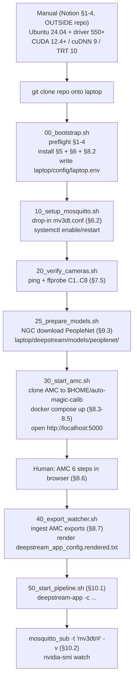

# Laptop DS 9.0 Scripted Testing — Operator Guide

This document is the **operator-facing** guide for the DS 9.0 laptop
scripted testing harness. It covers:

- the prerequisites that must already be done **outside this repo**,
- the exact run order of the numbered scripts under
  [`laptop/scripts/`](../scripts/),
- the end-to-end flow diagram,
- where files land on disk, and
- how to validate a running pipeline.

For the DS 9.0 package / OS setup and the 6-step AMC workflow, see the
companion doc [`DEEPSTREAM-SETUP.md`](DEEPSTREAM-SETUP.md).

## Prerequisites (manual, outside this repo)

Complete Notion page `337b5d58-7212-81e1-b07a-d510d9605bbb` **Sections 1–4**
on the laptop before cloning this repo. No script under
[`laptop/scripts/`](../scripts/) installs any of these; they only preflight
and fail fast with a pointer back to this doc if anything is missing.

| § | Manual step |
|---|-------------|
| 1–2 | Hardware (Ampere-or-newer NVIDIA GPU) and BIOS: Secure Boot / virt extensions as per motherboard vendor. |
| 3 | Dual-boot Ubuntu 24.04 (Rufus / balenaEtcher USB, Windows partition shrink, Ubuntu installer). |
| 4 | NVIDIA driver ≥ 550, CUDA Toolkit 12.4+, cuDNN 9.x, TensorRT 10.x. |

See [`DEEPSTREAM-SETUP.md`](DEEPSTREAM-SETUP.md) §1–4 for the step-by-step
procedure.

## Minimal post-clone sequence

Assuming §1–4 are satisfied:

```bash
git clone <this-repo> P2BP-25_26-Hardware_Test
cd P2BP-25_26-Hardware_Test
cp laptop/config/laptop.env.example laptop/config/laptop.env   # optional; 00 also prompts
sudo bash laptop/scripts/00_bootstrap.sh
```

`00_bootstrap.sh` runs the §1–4 preflight, installs DS 9.0 + GStreamer 1.24
(Notion §5) + Mosquitto (§6) + Docker/NVIDIA Container Toolkit (§8.2), writes
`/etc/profile.d/deepstream.sh`, and interactively populates
[`laptop/config/laptop.env`](../config/laptop.env.example).

## Script order

Run each script after the previous one has completed successfully. Everything
below is idempotent — re-runs are safe.

| # | Script | Notion § | What it does | sudo? |
|---|--------|----------|--------------|-------|
| 00 | [`00_bootstrap.sh`](../scripts/00_bootstrap.sh) | §5 + §8.2 (preflight §1–4) | Verify §1–4, install DS 9.0 + GStreamer + Mosquitto + Docker + NCT, write `laptop.env`. | yes |
| 10 | [`10_setup_mosquitto.sh`](../scripts/10_setup_mosquitto.sh) | §6 | Install [`laptop/mosquitto/mv3dt.conf`](../mosquitto/mv3dt.conf) into `/etc/mosquitto/conf.d/`, enable/restart the service. `--with-firewall` opens 1883/9001 via ufw. | yes |
| 20 | [`20_verify_cameras.sh`](../scripts/20_verify_cameras.sh) | §7.5 | Ping + `ffprobe` each enabled row in [`laptop/config/cameras.yml`](../config/cameras.yml); pass/fail table. `--allow-partial` to exit 0 on misses. | no |
| 25 | [`25_prepare_models.sh`](../scripts/25_prepare_models.sh) | §9.2–9.3 | Download the pinned PeopleNet NGC tag (only detector this harness installs) into [`laptop/deepstream/models/peoplenet/`](../deepstream/models/). | no |
| 30 | [`30_start_amc.sh`](../scripts/30_start_amc.sh) | §8.3–8.5 | Clone `NVIDIA-AI-IOT/auto-magic-calib` into `$HOME/auto-magic-calib/` (never under this repo), template `compose/.env`, `docker compose up -d`, open `http://localhost:5000`. | no (docker group) |
| — | _human_ | §8.6 | Complete the AMC 6-step workflow in the browser: Project Setup → Video Upload → Parameters → Manual Align → Execute → Results / Export. | — |
| 40 | [`40_export_watcher.sh`](../scripts/40_export_watcher.sh) | §8.7 | Watch `$HOME/auto-magic-calib/projects/$PROJECT_NAME/exports/`, try upstream `scripts/export_mv3dt.py` (fall back to raw copy), land artefacts in `laptop/deepstream/calibration/$LOCATION_ID/`, render `deepstream_app_config.rendered.txt`. `--oneshot` for single pass. | no |
| 50 | [`50_start_pipeline.sh`](../scripts/50_start_pipeline.sh) | §10.1–10.2 | Ensure `mosquitto` is up, ping-sweep C1..C8, source `/etc/profile.d/deepstream.sh`, `exec deepstream-app -c ...` from `laptop/deepstream/`; prints §10.2 validation helpers. | no (sudo for mosquitto only if not already active) |
| 99 | [`99_stop_all.sh`](../scripts/99_stop_all.sh) | — | Stop `deepstream-app` (SIGTERM → SIGKILL), `docker compose down` AMC, `systemctl stop mosquitto`. Per-step skip flags. | partial |

## End-to-end flow



## Where files land on disk

Inside this repo (committable where sensible; generated outputs are
gitignored via the nested [`laptop/.gitignore`](../.gitignore)):

| Path | Owner | Gitignored |
|------|-------|------------|
| `laptop/config/laptop.env` | `00_bootstrap.sh` | yes |
| `laptop/deepstream/models/peoplenet/` | `25_prepare_models.sh` | yes (the NGC download is ~100 MB) |
| `laptop/deepstream/calibration/<LOCATION_ID>/` | `40_export_watcher.sh` | yes (parent dir kept via `.gitkeep`) |
| `laptop/deepstream/deepstream_app_config.rendered.txt` | `40_export_watcher.sh` | yes |

Outside this repo:

| Path | Owner |
|------|-------|
| `/etc/mosquitto/conf.d/mv3dt.conf` | `10_setup_mosquitto.sh` |
| `/etc/profile.d/deepstream.sh` | `00_bootstrap.sh` |
| `$HOME/auto-magic-calib/` | `30_start_amc.sh` (clone of `NVIDIA-AI-IOT/auto-magic-calib`) |
| `$HOME/auto-magic-calib/compose/.env` | `30_start_amc.sh` (templated from `laptop.env`) |

## Validation

While `50_start_pipeline.sh` is running, in a second tty:

```bash
# MV3DT / SV3DT tracks (topic base from laptop/config/laptop.env).
mosquitto_sub -h 127.0.0.1 -t 'mv3dt/#' -v

# GPU utilization, memory, temperature.
watch -n 1 'nvidia-smi --query-gpu=utilization.gpu,memory.used,temperature.gpu --format=csv'

# Broker health.
systemctl status mosquitto --no-pager
```

You should see one JSON-ish payload per tracked object per frame on the
`mv3dt/<LOCATION_ID>/sv3d` topic and, once MV3DT fuses across cameras, on
`mv3dt/<LOCATION_ID>/fused`.

## Detector policy

PeopleNet is the **only** detector this harness installs and wires into the
pipeline, matching NVIDIA's DS 9.0 MV3DT reference documentation
([`DS_MV3DT.html`](https://docs.nvidia.com/metropolis/deepstream/dev-guide/text/DS_MV3DT.html)).
`yolo11n` (ultralytics `yolo11n.pt`) is the **single approved alternative**
detector reserved for future work — no script here installs it, exports it,
or adds a YOLO `[primary-gie]` block. See the header comment in
[`laptop/deepstream/config_infer_primary.txt`](../deepstream/config_infer_primary.txt)
and the `marcoslucianops/DeepStream-Yolo` entry in
[`.cursor/skills/deepstream-9-docs/reference.md`](../../.cursor/skills/deepstream-9-docs/reference.md)
(Third-Party / Community section) for the future-work path.

## Out of scope

- **Notion §1–4** entirely (hardware, BIOS, dual-boot Ubuntu, NVIDIA driver
  stack). Manual, outside this repo.
- **Notion §7.1–7.4** (per-camera IP + stream-profile setup via each
  camera's web UI). `20_verify_cameras.sh` only verifies the resulting
  RTSP streams.
- **Notion §11** (interactive troubleshooting decision tree). Scripts
  surface the relevant recovery commands inline on failure.
- Tailscale / NoMachine / ufw hardening, `mv3dt_bridge.py`, dashboard
  heartbeat, JSONL uploader, `LocationId` wire-format changes on the Jetson
  services.
- Systemd units for these scripts.

## Future work

Tracked deliberately outside this plan; noted here so the right place to
extend the harness is obvious:

- **Dashboard integration** — a `tailscale serve` or reverse-proxy front-end
  that surfaces `mosquitto_sub` streams and the AMC UI externally.
- **Systemd units** under `laptop/services/` that turn `10_`, `30_`, and
  `50_` into supervised services (would replace the manual script run order
  with `systemctl start laptop-mv3dt.target` or similar).
- **Second detector path** — add `yolo11n` (and only `yolo11n`) behind a
  `DETECTOR=yolo11n` flag in `laptop.env`, wiring it up per the
  `DeepStream-Yolo` integration catalogued in the skill. PeopleNet remains
  the default.
- **Inference Builder MCP** — if DS 9.0 template churn becomes painful,
  auto-generating
  [`laptop/deepstream/`](../deepstream/) via the MCP documented at
  [`DS_AI_Agent_MCP.html`](https://docs.nvidia.com/metropolis/deepstream/dev-guide/text/DS_AI_Agent_MCP.html)
  is the expected path.

## Further reading

- [`laptop/docs/DEEPSTREAM-SETUP.md`](DEEPSTREAM-SETUP.md) — DS 9.0 laptop
  setup (Notion §1–10 mirrored with DS 9.0 doc links).
- [`.cursor/skills/deepstream-9-docs/SKILL.md`](../../.cursor/skills/deepstream-9-docs/SKILL.md)
  — canonical DS 9.0 lookup path (Context7 `/websites/nvidia_metropolis_deepstream_dev-guide`
  → WebFetch → GitHub, in that order). Every external DS 9.0 URL in this
  subtree comes out of this skill's catalog.
- [`.cursor/skills/deepstream-9-docs/reference.md`](../../.cursor/skills/deepstream-9-docs/reference.md)
  — full URL + repo catalog used to verify plugin field names and workflow
  docs.
- DS 9.0 deepstream-app CLI:
  <https://docs.nvidia.com/metropolis/deepstream/dev-guide/text/DS_ref_app_deepstream.html>
- DS 9.0 MV3DT: <https://docs.nvidia.com/metropolis/deepstream/dev-guide/text/DS_MV3DT.html>
- DS 9.0 AutoMagicCalib:
  <https://docs.nvidia.com/metropolis/deepstream/dev-guide/text/DS_AutoMagicCalib.html>
